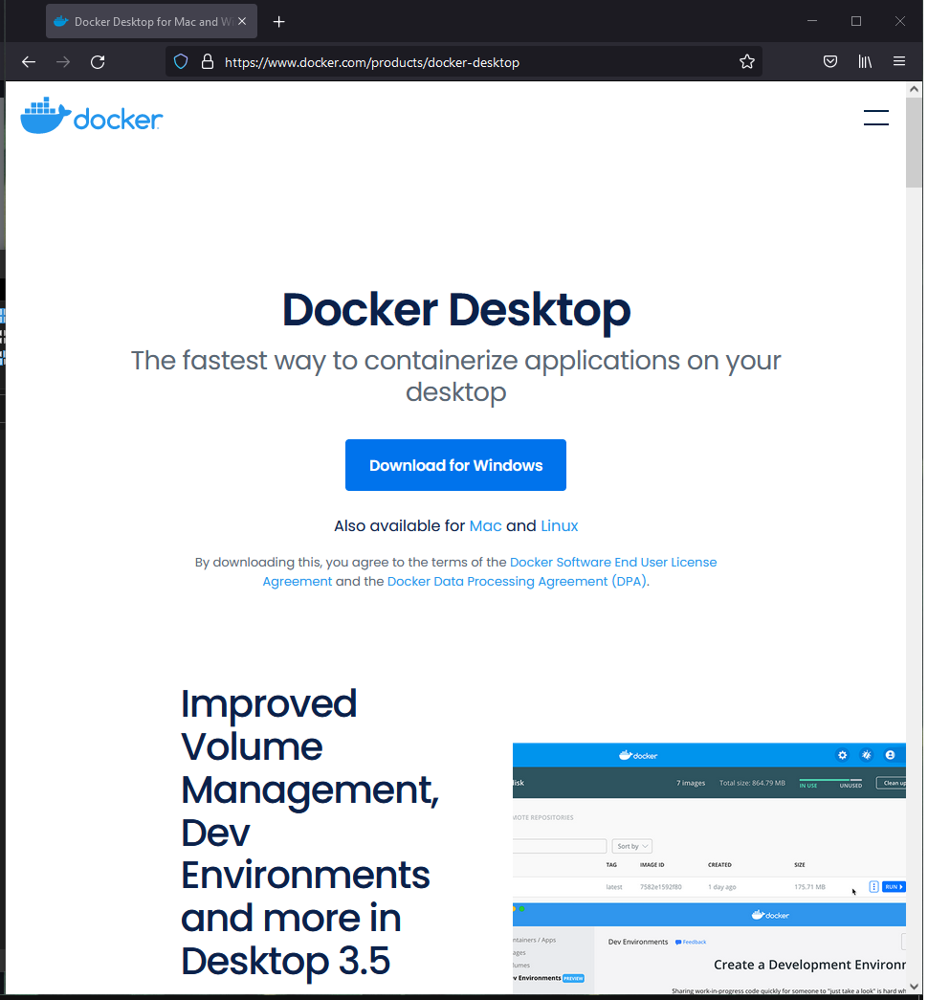
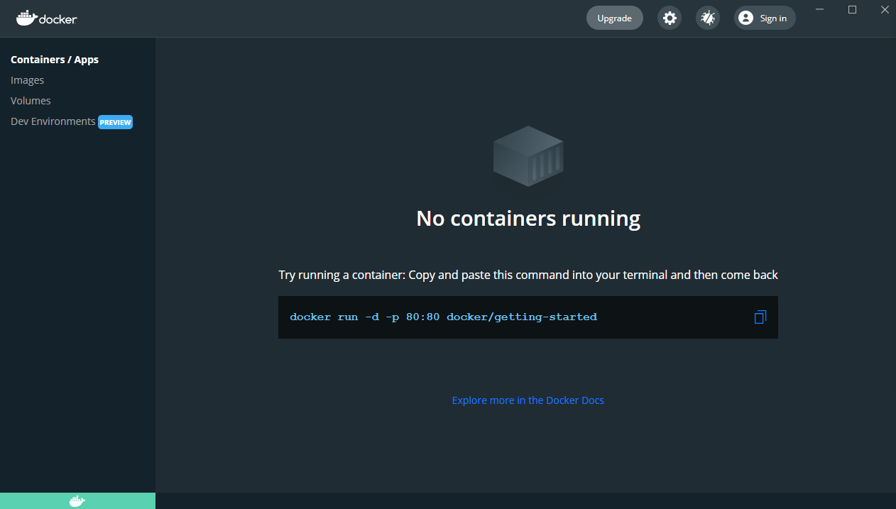

## Installation on Windows

You'll need to have a computer with the features detailed on the install page (https://docs.docker.com/docker-for-windows/install/).

You'll also need to have WSL 2 installed (https://docs.microsoft.com/en-us/windows/wsl/install-win10).

Before installing Docker, ensure that the Linux kernel update package is installed (https://docs.microsoft.com/en-gb/windows/wsl/install-win10#step-4---download-the-linux-kernel-update-package) and WSL 2 is set as the default version.

Windows Terminal is also recommened: https://docs.microsoft.com/en-us/windows/terminal/get-started

Download Docker Desktop from https://www.docker.com/products/docker-desktop and run the installer. Enable the extra WSL components when the installer gives you that option. Log out and back in again.

Start Docker Desktop from the start menu, and wait for it to start up. You might get a timeout error, but keep waiting. You can access it from the icon in the system tray. When it has started up successfully, you should see the status screen.

Copy the command that is shown: `docker run -d -p 80:80 docker/getting-started` and paste it into a Windows Terminal window:

Run the command, then go back to Docker Desktop dashboard and see the container running:

The buttons allow you to:

1. Open the container in a browser (it's running a web server on port 80)
2. Log into the container like it was a server
3. Stop the container
4. Restart the container
5. Delete the container

Click the button that opens the container. It will take you to http://localhost/tutorial/ which has more information about how Docker and the container are working.

Continue playing round, and when you're done you can stop the container and then delete it.

